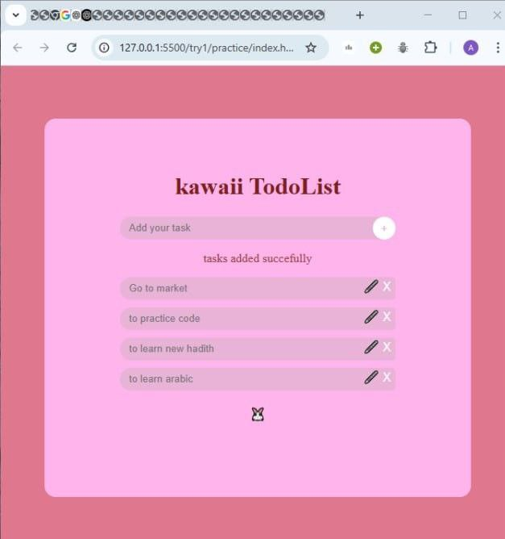

Project Title

Kawaii Todo List Box

I built a Kawaii Todo List — a website frontend designed with HTML and CSS. It helps users add tasks, view a list of successfully added tasks, and manage them by marking as done, editing, or deleting.

The interface features a soft pink color, reflecting the kawaii design trend, which emphasizes cuteness, friendliness, and positivity. A rabbit emoji is placed below the input box as a design element to enhance the web.

web image

C:\Users\Administrator\Pictures\Screenshots\photo_2025-07-06_21-23-18.jpg

The hard parts were how to use padding and margin in small spaces on the web, finding the right emoji for the bunny, and getting confused in the middle of the code.

The easy parts were making the HTML layout and writing the words.